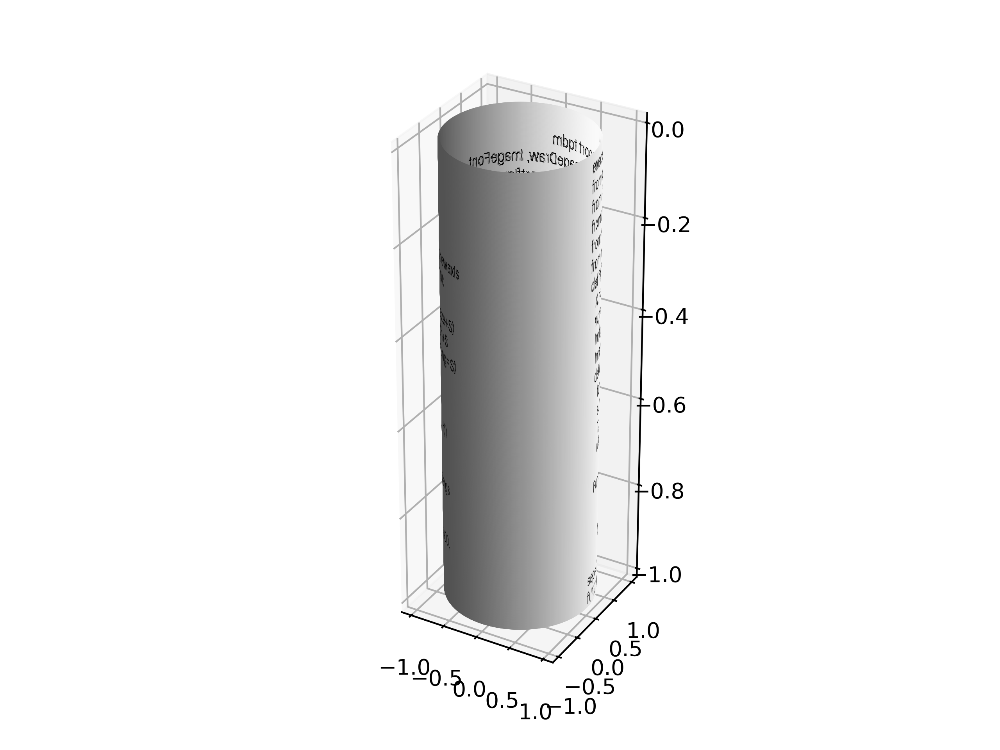

# cylinder-quine

A quine that creates a 3D model of itself.

The quine kind of sucks, I didn't want to write a specialized GIF encoder [again](https://github.com/donno2048/gif-quine) or to handle the 3D to 2D projection by hand, so I made the 3D model and used matplotlib for the projection and ffmpeg for GIF encoding.

Also, using tqdm to show a progress bar, PIL as an easy shortcut for reading the font file, and numpy just because without it Python math is very slow and the render will take days.

